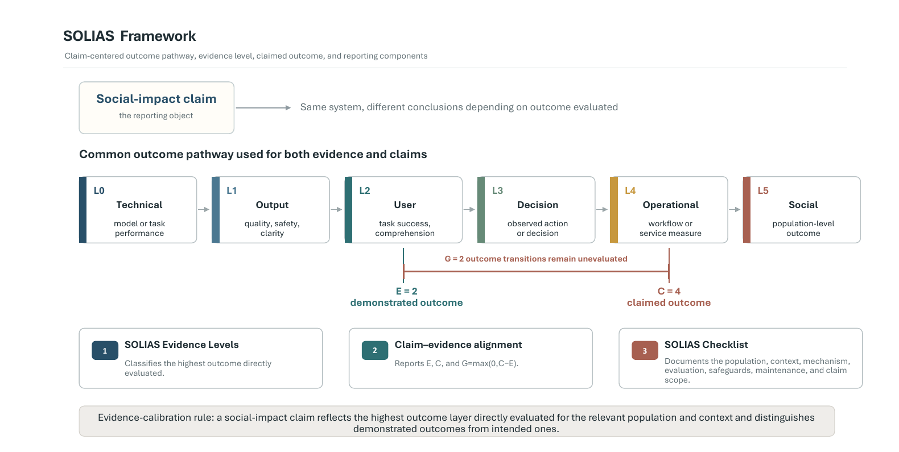

# SOLIAS

*SOLIAS: Reporting Social-Impact Claims in NLP*

**Srimonti Dutta · Akshata Kishore Moharir**

SOLIAS (Social Outcomes for Language-Integrated AI Systems) is a reporting format for relating social-impact claims in NLP to the outcomes a study directly evaluates. It combines six evidence levels, a claim-evidence profile `(E, C, G)`, and a 20-item checklist covering the population, context, pathway, evaluation, responsible-operation conditions, and scope of the conclusion.

**Publication status:** The paper is forthcoming. Publication and citation information will be added after release.

[**Quick reference**](docs/quick-reference.md) · [**Checklist**](checklist/solias-checklist.md) · [**Author form**](templates/author-form.md) · [**Reviewer form**](templates/reviewer-form.md) · [**Templates**](templates/) · [**Specification**](SPECIFICATION.md) · [**Machine-readable schemas**](schema/) · [**Worked examples**](examples/) · [**FAQ**](docs/faq.md)

---



## At a glance

| Core component | What it records | Main repository artifact |
| --- | --- | --- |
| Six evidence levels | Highest outcome layer directly evaluated | [Evidence-level guide](docs/evidence-level-guide.md) |
| Claim-evidence profile `(E, C, G)` | Demonstrated level, claimed level, and their gap | [Claim-alignment guide](docs/claim-alignment-guide.md) |
| 20-item checklist | Population, context, pathway, evaluation, responsible operation, and calibrated conclusion | [Checklist](checklist/solias-checklist.md) |

## Start with the artifact that matches your task

| If you are... | Start here | What it provides |
| --- | --- | --- |
| Writing a paper | [Author form](templates/author-form.md) | The complete prospective checklist in a form that can be filled directly or answered with manuscript page references |
| Reviewing a paper | [Reviewer form](templates/reviewer-form.md) | The six-step review sequence presented in the paper |
| Learning SOLIAS | [Quick reference](docs/quick-reference.md) | The six evidence levels, `(E, C, G)`, the claim template, and the main boundary cases |
| Preparing structured records | [Schema guide](schema/README.md) | A compact `(E, C, G)` schema, a full-report schema, blank templates, and completed examples |
| Adapting SOLIAS for a venue | [Venue adoption](docs/venue-adoption.md) | A compact reporting request based on the short-form fields described in the paper |
| Conducting evidence synthesis | [Evidence synthesis](docs/evidence-synthesis.md) | Guidance and a retrospective extraction schema for organizing studies by demonstrated and claimed outcomes |

## Framework

SOLIAS separates the intended outcome that motivates a research program, the demonstrated outcome directly evaluated for the population and context examined, and the claimed outcome presented as a result. These three elements use a common outcome pathway so that a technical contribution can remain connected to a broader objective while the evidentiary scope of the individual study stays explicit.

The standard uses the following evidence-calibration rule:

> A social-impact claim is evidence-calibrated when it reflects the highest outcome layer directly evaluated for the relevant population and context and clearly distinguishes demonstrated outcomes from intended ones.

## Six evidence levels

A study is assigned the highest level for which it presents direct evaluation. The levels identify the object of evaluation, while methodological quality is assessed within the relevant level.

| Level | Outcome | Direct evidence may include |
| ---: | --- | --- |
| 0 | Technical performance | Accuracy, F1, calibration, robustness, retrieval quality, benchmark results, or performance on a stated technical task |
| 1 | Output quality | Factuality, clarity, readability, harmfulness, usefulness, uncertainty expression, or expert and user judgments of outputs |
| 2 | User outcome | Comprehension, task completion, usability, time, confidence, error recovery, or accessibility in a controlled or realistic task |
| 3 | Decision or behavior | Observed decisions or actions by users, practitioners, moderators, teachers, clinicians, caseworkers, or other institutional actors |
| 4 | Operational outcome | Workflow performance, service uptake, referral completion, processing time, workload, institutional response, or deployment indicators |
| 5 | Social outcome | Health, learning, safety, inclusion, welfare, equity, environmental, or other population outcomes measured through an appropriate field design |

The [evidence-level guide](docs/evidence-level-guide.md), [operational definitions](operational-definitions.md), and [boundary cases](examples/boundary-cases.md) provide the assignment rules and representative adjacent-level cases.

## Claim-evidence profile

Each SOLIAS report records:

```text
E = highest outcome level directly evaluated
C = highest outcome level presented as a result
G = max(0, C - E)
```

The complete `(E, C, G)` profile retains both outcome levels together with their gap. For example, a Level 0 study with a Level 0 claim and a Level 4 study with a Level 4 claim both have `G = 0`, but they concern different outcomes and require different forms of methodological appraisal.

### Compact example

Suppose a public-service assistant is evaluated on whether applicants identify required documents more accurately in a simulated task. The measured outcome is a Level 2 user outcome. A conclusion about improved document identification can therefore be reported as `(E, C, G) = (2, 2, 0)`, while application completion and benefit uptake remain broader outcomes for subsequent operational evaluation.

The [claim-alignment guide](docs/claim-alignment-guide.md) gives the assignment sequence and the flexible claim template used in the paper.

## 20-item checklist

The checklist is organized into six reporting functions:

1. purpose and population;
2. system and pathway;
3. evidence and alignment;
4. outcome evaluation;
5. responsible operation; and
6. calibrated conclusion.

Authors may answer briefly, cite manuscript pages where the relevant information already appears, and mark an item not applicable when the justification is stated. The repository provides the [complete checklist](checklist/solias-checklist.md), an [author form](templates/author-form.md), a [reviewer form](templates/reviewer-form.md), and a [short form](templates/short-form.md).

## Machine-readable use

The [`schema/`](schema/) directory contains two prospective representations. The compact profile schema records `(E, C, G)` and validates the permitted relation among the three values. The full-report schema represents the prospective checklist, including demonstrated evidence, the claim presented as a result, evaluation measures, outcome-evaluation fields, responsible-operation fields, and the evidence-calibrated conclusion.

Blank JSON and YAML files under [`templates/`](templates/) are explicitly named as templates and leave substantive values unset. A completed disaster-response example is supplied in JSON and YAML and validates against the full-report schema. The [schema guide](schema/README.md) identifies the appropriate file for each use case.

## Worked examples

The repository reproduces the illustrative material in the paper in forms that can be consulted during writing or review:

- [completed disaster-response report](examples/disaster-response.md);
- [public-services example](examples/public-services.md);
- [healthcare example](examples/healthcare.md);
- [accessibility example](examples/accessibility.md); and
- [boundary cases for adjacent evidence levels](examples/boundary-cases.md).

## Review, venue use, and evidence synthesis

For peer review, SOLIAS separates identification of the demonstrated outcome from methodological appraisal of the evidence supporting that outcome. The [reviewer form](templates/reviewer-form.md) follows the sequence in the paper. Venues may begin with the compact fields described in [venue adoption](docs/venue-adoption.md). Evidence syntheses can organize studies by the outcome directly demonstrated while retaining the claimed outcome and the transitions represented in the claim; a separate [evidence-synthesis guide](docs/evidence-synthesis.md) and retrospective extraction schema are available for that use.

## Retrospective audit in the paper

The paper applies SOLIAS to 168 papers as an empirical illustration of the distinctions provided by the standard. In that corpus, 97.6% of papers were assigned Level 0 demonstrated evidence and 35.7% had a claim-evidence gap of at least two outcome levels. The paper treats these rates as corpus-specific descriptive results rather than prevalence estimates for NLP research as a whole.

## Governance and domain profiles

The repository follows the release and governance plan in the paper. Clarification requests, implementation problems, domain-profile proposals, and proposed changes to the common classification have separate issue forms. Domain profiles may add examples, measures, safeguards, and implementation guidance for a particular setting while preserving the six evidence levels and the `(E, C, G)` representation.

See [GOVERNANCE.md](GOVERNANCE.md), [CONTRIBUTING.md](CONTRIBUTING.md), and [domain profiles](docs/domain-profiles.md).

## License

Repository materials are released under the [Creative Commons Attribution 4.0 International license](LICENSE) (CC BY 4.0).
